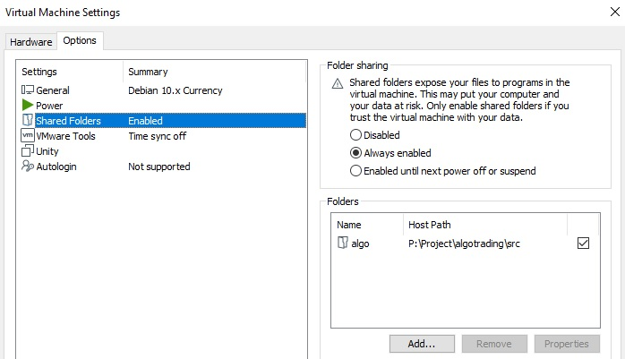

Save binance cryptocurrency to database (Reduced Amateur Project)

Add folder "algo" in virtual machine

Add project folder at virtual machine (linux server):
```python
sudo /usr/bin/vmhgfs-fuse .host:/algo /home/alex/project/algo -o subtype=vmhgfs-fuse,allow_other,nonempty
```
The project will be transferred to the virtual machine and will be available for development

Install dependencies and run the containers:

$ docker-compose up -d --build

